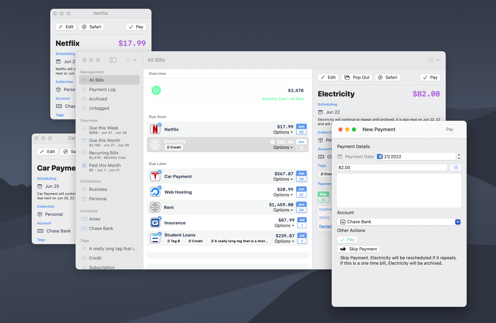

## Features

### 🪟 Native macOS windowing

> 
> Bills io is now written for the Mac with native macOS window management

### 📝 Payment note copying

> 
> Copy your notes from previous payments to grab that confirmation number you didn't know you needed until now.

### 🧑‍💻 Markdown support in Payment notes

> 
> Notes for payments will now render with basic markdown syntax

### 🧮 Calculated costs for bills without a specific amount

> 
> Bills don't have to have an exact amount due. Just enter the amount you pay every month and let Bills io calculate the average amount. Oh, and yes, this is automatically added to your average Bill spend calculations.

### 👆 New swipe actions throughout the app

> 
> Swipe to pay, swipe to archive, and swipe to restore that accidentally archived Bill.

## Fixes

### 🗑 Archived bills are now more distinguished from active bills

> 
> Bills io now includes a dedicated archived Bills section.

### 💸 Future payments now have a dedicated overview feature

> 
> Schedule a payment for a later date online, and now you can record that in Bills io in a dedicated section. Come back later to remind yourself of what payments are still processing.