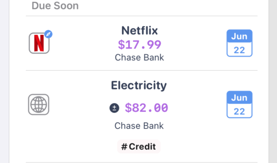

## Overview

Happy 🏖 summer! This update has a long requested feature for many, data exporting. You can now export all of your Bills or Payments to a CSV (Comma Separated Value) file and open in Excel / Numbers. Drilling down into a filtered list will allow you to export a subset of Bills or Payments. For instance, if you have a Collection for Work, you can just export those payments.

There are many changes planned for this fall, but before that, the Bill listing page has been cleaned up. There is now an accented calendar icon that shows your next due dates. Feel free to tap that for a quick way to access the context menu.

Thanks for everyone's support, and enjoy 🍻

## Features

### 📃 Export Documents (Premium only)

> 
> Pro tip, filter Bills by Account, Collection, or Tag to export specific Bills or Payments

## 🎨 Refreshed Bill UI

> 
> Easier to see due dates
> Quick tap the favicon to jump to the Bill website URL
> Tags are now visible in the Bill list

## 🔨 Fixes

- Monthly cost calculation for non-repeating bills is resolved
- Deletion bug on archiving all bills in section