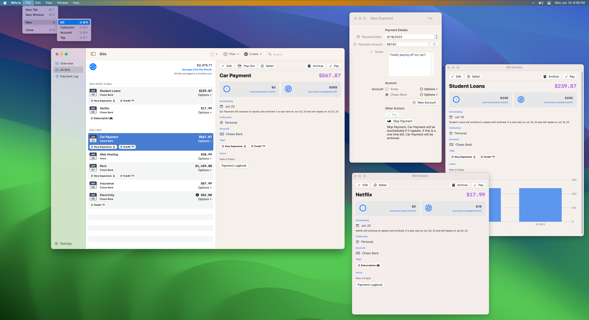
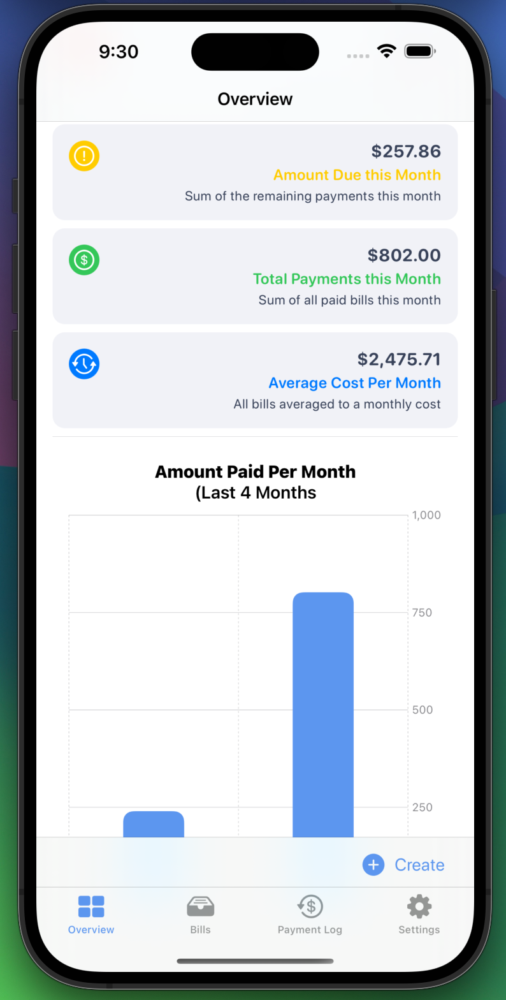
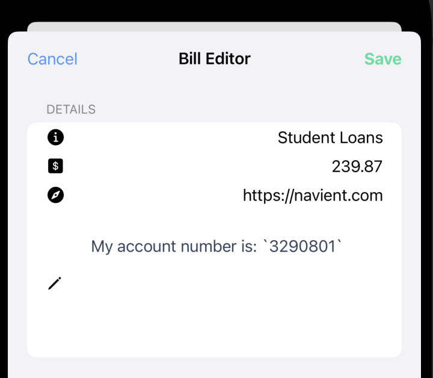
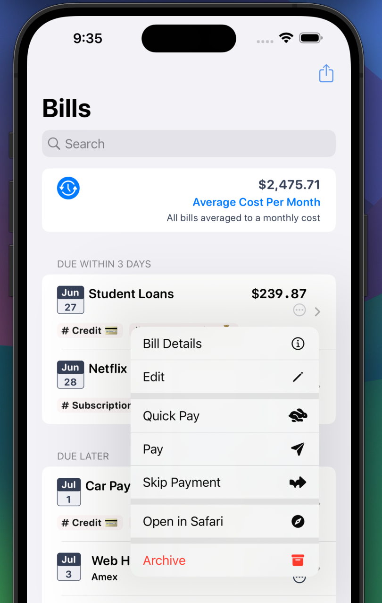
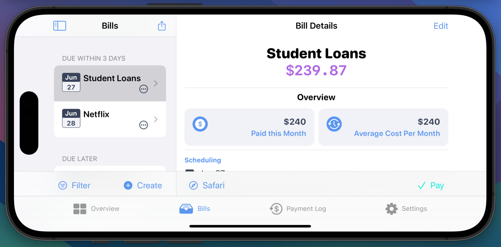

## Overview

A lot of work went into this release and will allow for easier updates in the future. All of the code is now shared between iOS, iPad, and macOS versions to bring features out faster and with more consistency between platforms. Thank you for your support, and I hope you enjoy this release!

This is a major update that brings a lot of behind the scenes maintenance for future features. But, rest assured, there are a lot of great additions included as well.

Cheers 🍻

P.S. This page will include patch updates notes for v3.0.1 and v3.0.2.

## Features

### 📊 Graphs! (Premium)

You can now see a visual overview of how much money is going out per month or dive into each bill and see month by by month amounts

> 

### 🔎 Search

Search for Bills or Payments by name, account name, or tag name.

> 

### 🗄️ Filtering (Premium)

Filters have replaced the multiple list options to organize bills. You can now stay in the same list and change filters for various accounts, tags, collections, or see all of the archived bills. (Premium for Account, Tag, and Collection filtering)

> 

### 🪟 Windowing

The macOS app has been re-worked to include better native window management with keyboard shortcuts for creating new items. There is also support added to the iPad for popping out windows for individual bills. Keep a bunch of bills open in Stage Manager while paying in Safari for instance. (More window updates will be coming)

> 

### 🤓 Redesigned Overview Section

Added graphs and general information blocks to the overview section to see what is due when and for how much.

### 📝 Bill Notes (Premium)

Jot down any information and save it with a bill. Account numbers, addresses, or anything else.

> 

### 📑 Inline Account, Tag, and Collection selectors (Premium)
 
You can now make edits to any of your organizational tools in-line and while paying or editing a bill.

> 

### 🧑‍💻 Additional Menus

Adds extra options to the menus for Bills and Payments.

> 

### ⛰️ Landscape Interface

Use Bills io in any orientation

> 

## 🔨 Fixes

- Adding urls no longer need http:// or https:// for Safari to open the link
- Updated the purchasing logic for in-app purchases
- Includes a new purchase overview block to show exactly which subscription is bought and in use
- Updated the Spanish translations
- v3.0.2 Search is case-insensitive
- v3.0.2 Bill and Payment list performance improvements
