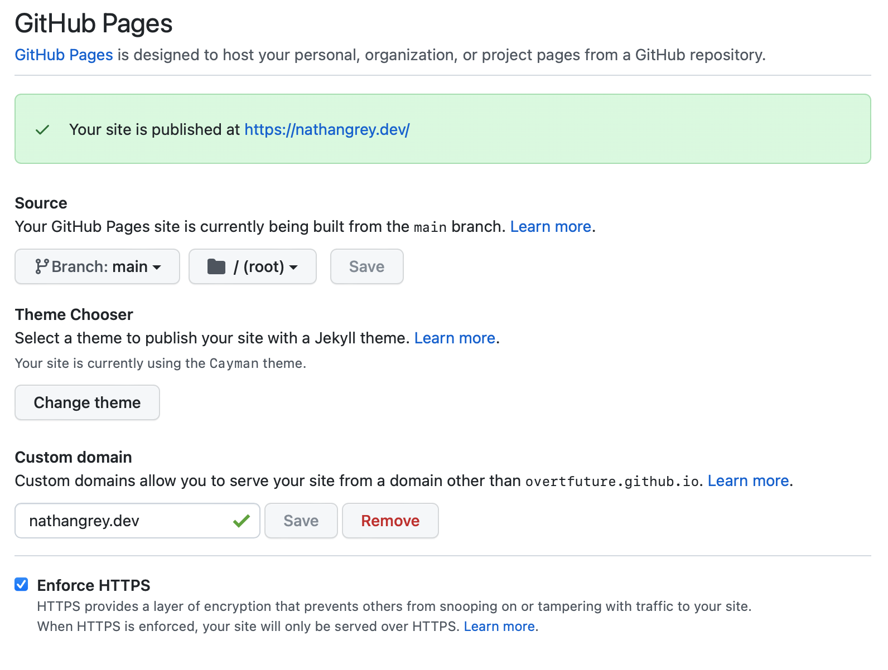

Ever have a problem purchasing domains to use later? I do, and started to collect a few without a destination or time to set up a use. Some of these domains had secure only top level domains (.dev & .app specifically). I wanted to set a couple of these domains to redirect here, [studioember.com](https://studioember.com). Unfortunately, [Hover](https://hover.com) only allows redirects for regular domains that support http connections, basically anything besides the TLD's I have.

## GitHub Pages

I will quickly go over the first step in this process, setting up a standard GitHub Page with a custom domain. At the time of writing, GitHub has a [great tutorial](https://docs.github.com/en/pages/configuring-a-custom-domain-for-your-github-pages-site/managing-a-custom-domain-for-your-github-pages-site) that specifies these domain records:

Type   | Host  | Value
-------|-------|---------
 CNAME |   @   | GITHUB_USERNAME.github.io
 CNAME |  WWW  | GITHUB_USERNAME.github.io
 A     |   @   | 185.199.108.153
 A     |   @   | 185.199.109.153
 A     |   @   | 185.199.110.153
 A     |   @   | 185.199.111.153

Then, in your redirect project, create a CNAME file with the custom domain. See the [CNAME file](https://github.com/overtfuture/profile/blob/b47efc04f840a9198227b308463d2a23185024af/CNAME) in my [profile redirect repository](https://github.com/overtfuture/profile) for an example.

file: `CNAME`

```plaintext
nathangrey.dev
```

Once you have a pages site published, DNS resolving, and everything is green in the repository settings, you can set up the redirects.



## Redirecting

By default GitHub pages uses Jekyll for a frontend. This redirect setup uses the standard Jekyll markdown files and includes a simple plugin to handle the redirects.

Below is the full basic setup for a root redirect

[file](https://github.com/overtfuture/profile/blob/fe83b26b3f17b9ee76c57465e70cc5addae93089/_config.yml) `_config.yml`

```yaml
theme: jekyll-theme-cayman # any theme is fine
plugins:
  - jekyll-redirect-from   # Relevant plugin
```

[file](https://github.com/overtfuture/profile/blob/fe83b26b3f17b9ee76c57465e70cc5addae93089/index.md) `index.md`

```md
---
title: Studio Ember
redirect_to: https://studioember.com
---
```

This setup gives the bare minimum to redirect a root domain to another url. To add other paths or a fallback for all paths, add the explicit path as a markdown file and a `404.md` file. For instance, on my profile site, I set up a redirect to Linkedin with a simple file.

[file](https://github.com/overtfuture/profile/blob/fe83b26b3f17b9ee76c57465e70cc5addae93089/linkedin.md) `linkedin.md`

```md
---
title: My LinkedIn Profile
redirect_to: https://www.linkedin.com/in/nathangrey/
---
```

This file takes the path from [nathangrey.dev/linkedin](nathangrey.dev/linkedin) and resolves to [https://www.linkedin.com/in/nathangrey/](https://www.linkedin.com/in/nathangrey/). Super simple, but a quick way to have a portfolio type link to hand out and be able to change the destination after the fact.

Hope this helps, and the full repository can be found on my [GitHub profile repository](https://github.com/overtfuture/profile/tree/v1.0.0).
